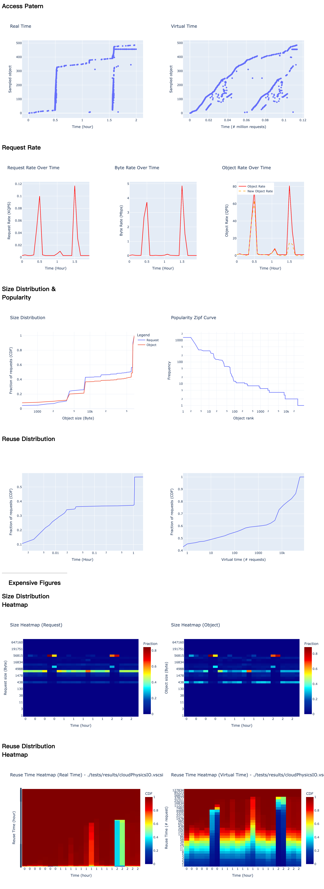

# traceboard
A dashboard for trace analyzer

## Example

### Using libCacheSim to Analyze Traces

#### Install libCacheSim
```bash
$ git submodule init
$ git submodule update
$ bash libCacheSim/scripts/install_dependency.sh; bash libCacheSim/scripts/install_libcachesim.sh
```

#### Analyze

```bash
$ libCacheSim/_build/bin/traceAnalyzer libCacheSim/data/cloudPhysicsIO.oracleGeneral.bin oracleGeneral --all
```


### Show in Board

```bash
$ python board.py
```



